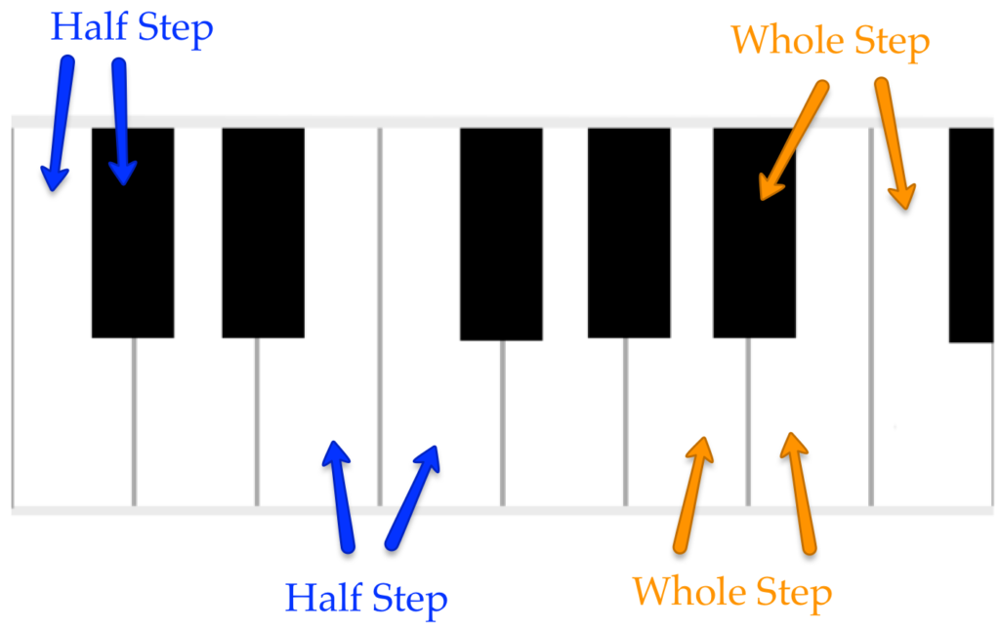
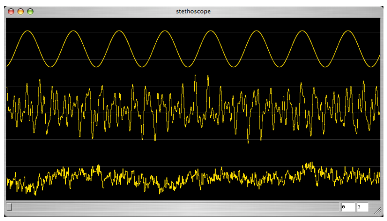
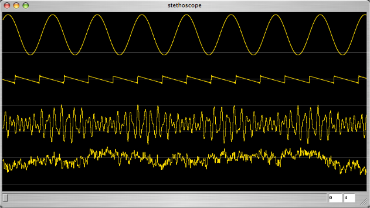
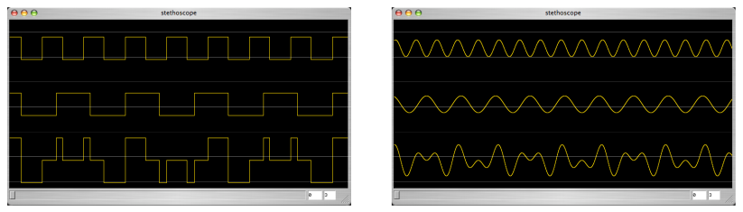
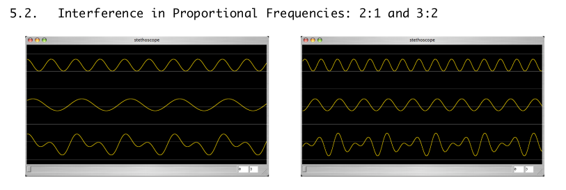
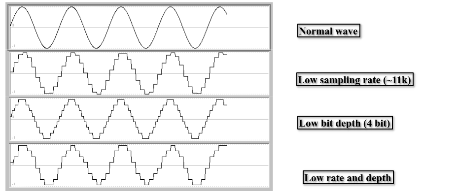

## Digital Music

### MIDI

Lowest note is C-1 with a MIDI number of 0. Each octave has 12 numbers. Each _half-step_ or _semitone_ is a number.

Note | MIDI Number
--- | ---
C0 | 12
C1 | 24
C2 | 32
C3 | 48
C4 | 60



## Sound
### Patterns, Noise, Periods

Types of Waves:  
Clear pattern: Periodic  
"Complex" pattern.  
No pattern: Aperiodic  



Sounds that have a periodic pattern are heard more or less (to the same degree as the clarity of the pattern) as pitch. The clearer the pattern, the clearer the character of the pitch. The absence of pattern approaches noise. In electronic music and synthesis terms, *noise is a wave with no apparent pattern.*  

The number of times the wave moves through its period in one second is the frequency of the wave, expressed in hertz or cycles.

### Properties of Sounds

The speed of a sound depends on temperature, altitude, and air density. For this text, <ins>1000 feet per second will be used.</ins>  

Wave length and speed are important for understanding echo and reverb, phase cancellation, as well as proper microphone and speaker placement.

### Frequency

Frequency is the number of cycles per second of a periodic wave. <ins>The musical equivalent of frequency is pitch.</ins>  

Middle C on the piano has a frequency of about 261 cycles per second (261 Hz). The lowest key on the piano is about 50 Hz and the highest is about 4000 Hz.  

There is theoretically no lower limit to audible frequency but pitch begins at 25Hz.  

Melodies and harmonies are made up of frequencies that sound either at the same time or consecutively. We hear them as music if they are *related mathematically.* These relationships are described as intervals, using terms such as octave, fifth, minor, third, and so on.

Interval: 2x higher, 1.5x higher, etc.  
Octave: 440 880, 1200 2400

### Phase

Phase affects how two waves interact. Doesn't affect how we perceive sound.

### Amplitude

Height of peaks and depths of valleys. Musical equivalent is volume. Amplitude in measured in decibels (dB).  

Like intervals, decibels measure relative rather than absolute amplitude. It expresses a ratio, rather than an explicit value.  

In general, the difference between the quietest and the loudest sounds you would want to hear is about 120 dB. One level of dynamic<sup>[1](#dynamic)</sup> (mezzo forte to forte) is about 7dB.

[<a name="dynamic">1</a>]: Variation of loudness between notes/phrases.

### Harmonic Structure

Harmonic structure is the presence/strength of <ins>upper harmonics.</ins> The musical equivalent to harmonic
structure is _tone_ or _timbre_. The graphical representation of timbre is the wave shape.  

"Bright" sound - Sharp edges to peaks and valleys. (Pulse wave, sawtooth, triangle)  
"Dull" sound -  Smoother shape. (Sine wave)  

There is no standard measure for timbre.  

Things that change timbre: shape of mouth, embouchure<sup>[2](#embouchure)</sup> , angle of bow, different instruments, etc.  

The presence or strength of these harmonics is what defines a violin, oboe, piano, a human voice, etc.

[<a name="embouchure">2</a>]: the way in which a player applies their mouth to the mouthpiece of a brass or wind instrument, especially as it affects the production of the sound.

### Exercises

#### 4.1



Lowest - A  
Softest - B  
Highest pitch - B  
Brightest sound - B  
Aperiodic - D  
Periodic - All but D  

#### 4.2

Frequency (Hz) | Length (ft)
--- | ---
10 | 100
250 | 4
440 | 2.27
1000 | 1

#### 4.3

Lowest audible pitch - 20 Hz  
Highest audible pitch - 20 kHz

#### 4.4
(2 * 400) / 1000 = 0.4
#### 4.5
TODO
#### 4.6
TODO
#### 4.7
TODO
#### 4.8
TODO

## Party Conversation

### Constructive and Destructive Interference

In constructive interference, the amplitudes of the two waves add together resulting in a higher wave at the point they meet. In destructive interference, the two waves cancel out resulting in a lower amplitude at the point they meet.



[More on Constructive and Destructive Interference](https://www.phys.uconn.edu/~gibson/Notes/Section5_2/Sec5_2.htm)

### Musical Intervals
(Page 40)  

When two waves are related by some ratio, we hear the aggregate interference patterns as a musical interval. Complex or remote relationships (difficult maths) make us uneasy, sound dark, even scary. Simple relationships are predictable, relaxing, maybe boring.  



The interval between two notes is the distance between two pitches - in other words, how much higher or lower one note is than the other. The concept is so important that it is impossible to talk about scales, chords, harmonic progression, cadence, or dissonance without referring to intervals.  

Scientists usually describe the distance between two pitches in terms of the difference between their frequencies. Musicians find it more useful to talk about interval. Intervals can be described using _half-steps_ or _whole-steps_.  

Intervals are described using numbers depending on how many letter names of the musical alphabet are between two notes. Two notes = second, three notes = third, etc.

Pitches derived from multiples (overtones, harmonics) make up musical scales. When a group of such notes are played together they seek a tonal centre of gravity. The centre of gravity is the lowest common denominator, or the lowest frequency of the multiples. When they are played sequentially or consecutively our ears accept the lower pitches on the harmonic series as stronger or more stable, the fundamental being the strongest; a home base.  

Western tonal music is built using motion away from the stable, or consonant structures, to dissonant structures, to dissonant structures and back to consonant again. That motion, and the relative consonance/dissonance in infinite variation, is what we find satisfying in the works of Bach, Wagner, Schoenberg, Chick, Corea, and Alison Kraus. All styles can be boiled down to motion to and from low ratios and high rations, consonance and dissonance, structure and prolongation, stability and instability, low on the harmonic scale to high on the harmonic scale, tonic to dominant to tonic.

### Tuning, Temperament, and the Pythagorean Comma

Pianos (and other fretted instruments) are not in tune. By nature, they cannot be tuned correctly to pure rations. There are not enough keys of frets (and the frets are fixed).

While non-fretted instruments and the human voice can tune to pure ratios, in many cases they don't. For example, when a choir sings with piano accompaniment. They tune to the piano, which is incorrect.

### Exercises

TODO

## Sound Quality, Recording, and Editing Techniques

Current standard for CD quality audio is stereo, 44.1k sampling rate, 16 bit depth. We can hear up to 22k and distinguish amplitudes ranging 90db. 44.1k can capture a 22k wave, 16 bit produces a 144db dynamic range.

## Sample Rate

3 issues that affect sampling rate:
- frequency range
- aliasing
- file size

Sampling rate for CDs is based on Nyquist theorem:

> In order to adequately reproduce a signal it should be periodically samples at a rate that is 2x the highest frequency you wish to record.

A sampling rate is considered high if it is more than 2x the highest frequency. This is called "oversampling." Not always a bad thing, but takes longer and results in a greater file size.

Most instruments product frequencies beyond our hearing range. These frequencies are still important for two reasons:
1. Aliasing may occur at frequencies above the sample rate. Recording at a higher sampling rate reduces the risk of aliasing.
2. Frequencies beyond human perception interact to produce artefacts in lower frequencies. (In other words, natural aliasing.)

There is always the option to down sample but not up sample. So a high sampling rate is a safer bet.

## Bit Depth

Sample rate is how many samples are taken per second. Bit depth is the size of the numbers used for the samples. Bit depth represents amplitude, since larger numbers can accurately describe wider ranges of amplitude. Each additional bit translates into an additional 7db range. The difference between 8 and 16 bit is about 50db. So recording at 8 bit is analogous to recording at -50db.

**Recording at lower bit depth adds noise, or a grainy sound.** If you tried to sample a wave using only 4 bit numbers, no matter how high the sampling rate was, the results would be grainy. The grainy sound comes from a soft of *rounding down* or *quantization* to the nearest integer. **If, for example, the actual sound wave fluctuated between the numbers 6 and 7 the samples would all have to be rounded to 6, and that additional information (activity between 6 and 7) would be lost.**




## File size

Attention to efficiency and economy reflect the skills of an engineer. 44K, 16bit is usually enough.

## Noise

Sources of noise: DA conversion noise - low sample rate/bit depth. **Noise cannot be eliminated completely in a recording.** The presence of noise is expressed as the signal-to-noise ratio, measured in db.

Example: An amplifier has a -80db signal-to-noise ratio. This means that if you were to increase the **gain** of a signal by 80db, the background noise from the amp will be as loud as the signal you are listening to.

Strategies for Dealing With Noise:
1. Quality equipment
2. Reduce noise source, record in a quiet location.  
3. Set optimum levels (requires engineering skills)  
A lower recording level is closer to the bed of noise you want to be above. Before recording a source, you should set **input gain** as high as possible without causing **distortion**.
4. Use appropriate microphone proximity  
This increases the signal in relation to noise. However, depending on the situation, placing the microphone further away may actually be desirable. One example is if the recording environment is a hall with good acoustics. In this case, the hall reverb is not considered "noise."
5. Use digital noise reduction (Last resort)  Ideally this would not be used at all as it always compromises the quality of the signal you wish to keep. **Signal processors** are used to compensate for poor engineering and poor quality equipment.

## Distortion

Distortion is the **misrepresentation of a wave**. This can occur when there is a low sample or low bit rate, and appears as jagged edges. Distortion should be avoided when trying to accurately represent a signal, but it can be used creatively.

Disortion typically comes from pushing an audio device beyong its physical capacity to respond. The medium is then "saturated" or overdriven. When the source goes beyond that physical barrier it is not reproduced and therefore lost, or clipped. The result is the loss of upper frequency and a fuzzy or gravely sound.

It is possible to overdrive a microphone by placing it too close to the source. The most common source of distorion is saturing an electrical or digital component in the signal path.

Other things related to recording/production on pages 50-58.

# Digital Synthesis Using SuperCollider

Basic Patch
```supercollider
{SinOsc.ar(LFNoise0.ar([10, 15], 400, 800), 0, 0.3)}.play
```
